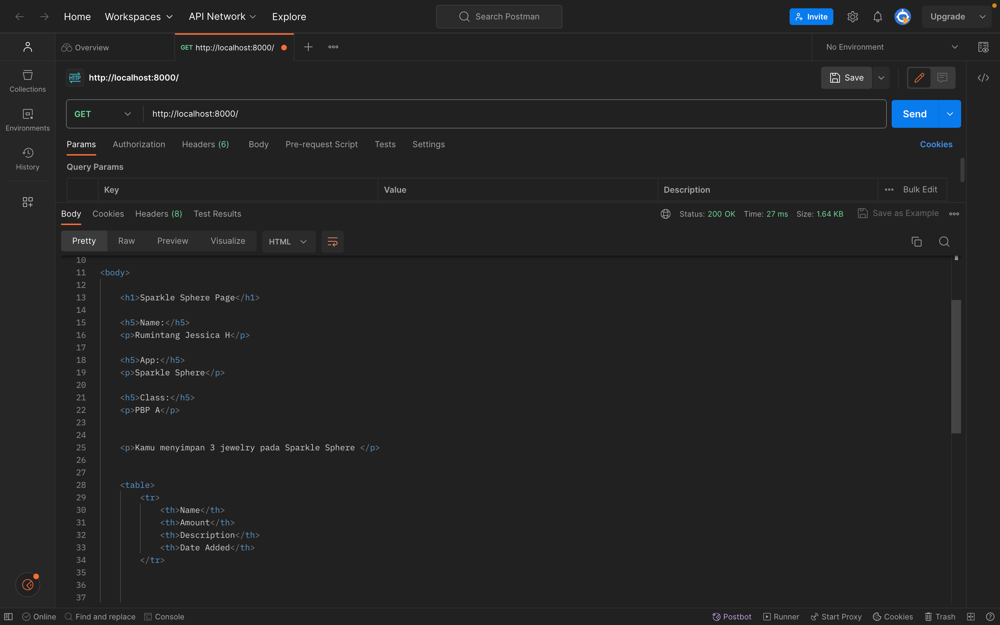

# Tugas 2
### Nama: Rumintang Jessica H <br>
### Kelas: PBP A <br> 
### Nama App : [Sparkle Sphere](https://sparkle-sphere.adaptable.app/main/) 🔮💍 <br>

## 1. Jelaskan bagaimana cara kamu mengimplementasikan checklist di atas secara step-by-step (bukan hanya sekadar mengikuti tutorial)
Djanggo sendiri merupakan suatu framework yang cukup umum dalam pengembangan webdev dengan bahasa pemrograman Python.<br>

### Membuat Direktori dan Mengaktifkan _Virtual Environment_
* Untuk membuat proyek Django baru, kita perlu membuat direktori baru yang saya namakan ```sparkle_sphere```. Setelah itu saya membuat _virtual environment_ dengan menjalankan perintah <br> 
    ```
    python -m venv env
    ```
    Setelah itu saya mengaktifkan _virtual environment_ yang telah dibuat sebelumnya dengan menjalankan perintah <br> 

    * Unix (Mac/Linux): <br>

        ```
        source env/bin/activate
        ```
    _Virtual environment_ yang aktif akan ditandai dengan `(env)` pada baris _input terminal_. <br> <br>

### Menyiapkan _Dependencies_ dan Membuat Proyek Django    
Selanjutnya saya menyiapkan _depedencies_ dan membuat proyek django. _Dependencies_ adalah bagian penting dalam perangkat lunak yang memastikan komponen bekerja bersama. Mereka bisa berupa _library_, _framework_, atau _package_ yang dibutuhkan. Dependencies mempercepat pengembangan, tetapi perlu manajemen versi yang hati-hati. Lingkungan virtual membantu mengisolasi dependencies antar proyek. <br>
* Di dalam direktori `sparkle_sphere` saya membuat berkas yang bernama `requirements.txt` dan menambahkan beberapa _dependencies_. <br>
    ```python
    django
    gunicorn
    whitenoise
    psycopg2-binary
    requests
    urllib3 
    ```
* Kita dapat memasang _dependencies_ dengan menjalankan perintah berikut. Namun, sebelumnya kita harus mengaktifkan _virtual environment_ terlebih dahulu sebelum menjalankan perintah pada terminal. <br>
    ```
    pip install -r requirements.txt
    ```
* Kemudian saya membuat proyek Django yang bernama `sparkle_sphere` dengan perintah sebagai berikut.<br>

    ```
    django-admin startproject shopping_list .
    ```
    Kita harus memastikan bahwa karakter `.` tertulis di akhir perintah. <br><br>

### Konfigurasi Proyek dan Menjalankan _Server_
Sekarang, kita sampai pada tahan konfigurasi proyek dan menjalankan server.
* Pada file `settings.py` kita perlu menambahkan `*` pada `ALLOWED_HOSTS` untuk keperluan _deployment_:
    ```
    ...
    ALLOWED_HOSTS = ["*"]
    ...
    ```
* Dalam konteks deployment, ALLOWED_HOSTS adalah daftar host yang diizinkan untuk mengakses aplikasi web. Jika saya mengatur nilai ALLOWED_HOSTS menjadi ["*"], ini akan memberikan izin akses kepada semua host, yang berarti aplikasi dapat diakses secara luas. Namun, kita harus berhati-hati saat menggunakan pengaturan ini, dan sebaiknya hanya digunakan dalam situasi tertentu, seperti saat melakukan uji coba atau tahap awal pengembangan. <br>
    
* Sebelum menjalankan perintah untuk mengetes server sudah berjalan atau belum, kita harus memastikan bahwa berkas `manage.py` ada pada direktori yang aktif pada _shell_ saat ini.<br>
    ```
    ./manage.py runserver
    ```
    Kita bisa membuka http://localhost:8000 pada peramban web untuk dapat melihat animasi roket yang menandakan aplikasi Django berhasil dibuat. <br>

### Menghentikan _Server_ dan Menonaktifkan _Virtual Environment_
* Untuk menghentikan _server_, saya menekan `Control+C` pada _shell_ sebagai pengguna Mac.
    Untuk menonaktifkan _virtual environment_ dengan menjalankan perintah: <br>

    ```
    deactivate
    ```
**Dengan demikian aplikasi Django telah dibuat!**

### Unggah Proyek ke Repositori GitHub
* Saya membuat repositori GitHub yang bernama `Sparkle-Sphere` dengan visibilitas _public_.<br>
* Selanjutnya saya menginisiasi direktori `sparkle_sphere` sebagai repositori Git yang terdapat pada tutorial sebelumnya.
* Setelah itu saya menambahkan berkas `.gitignore`. <br>
    * Berkas `.gitignore` adalah konfigurasi di Git yang menginstruksikan Git untuk mengabaikan berkas dan direktori tertentu, seperti berkas hasil kompilasi, berkas sementara, atau konfigurasi pribadi. Ini untuk memastikan Git tidak melacak berkas-berkas tersebut dalam versi kontrol.
* Kemudian saya melakukan `add`, `commit`, dan `pnush` dari direktori repositori lokal.<br>

### Membuat Aplikasi `main` dalam Proyek Sparkle Sphere
Pada langkah ini saya membuat aplikasi baru bernama main dalam proyek yang telah saya buat sebelumnya yang bernama Sparkle Sphere.<br>
* Sebelum kita membuat aplikasi main, kita perlu mengaktifkan _virtual environment_ dengan menjalankan perintah seperti diatas.<br>
* Selanjutnya kita menjalankan perintah berikut untuk membuat aplikasi baru.<br>
    ```
    python manage.py startapp main
    ```
    setelah perintah tersebut dijalankan, akan terbentuk direktori baru dengan nama ```main```.<br>
* Selanjutnya kita perlu mendaftarkan aplikasi ```main``` kedalam proyek Sparkle Sphere dengan cara menambahkan ```'main'``` pada variabel ```INSTALLED_APPS``` yang terdapat pada berkas ```settings.py``` dalam direktori ```sparkle_sphere```.<br>
    ```
    INSTALLED_APPS = [
    ...,
    'main',
    ...
    ]
    ```
**Maka aplikasi ```main``` telah terdaftar dalam proyek Sparkle Sphere**

### Mengonfigurasi _Routing_ URL Aplikasi ```main```
Untuk dapat membuat routing pada aplikasi ```main```, kita harus membuat berkas ```urls.py``` pada direktori ```main```. <br><br>
Selanjutnya kita perlu mengisi ```urls.py``` dengan kode berikut. <br>
```
from django.urls import path
from main.views import show_main

app_name = 'main'

urlpatterns = [
    path('', show_main, name='show_main'),
]
```
**Penjelasan kode:**
Berkas ```urls.py``` dalam aplikasi ```"main"``` mengatur rute URL khusus untuk aplikasi tersebut. Dalam pengaturan ini, kita menggunakan path dari ```django.urls``` untuk menentukan pola URL. Fungsi ```show_main``` dari modul ```main.views``` digunakan sebagai tampilan yang akan ditampilkan saat URL terkait diakses.<br>

### Membuat Model pada Aplikasi Main
Sebelum menjelaskan lengkah-langkah membuat model pada aplikasi Main. Apa itu Model? Model dalam konsep MVT bertanggung jawab atas pengaturan dan manajemen data aplikasi. Model mencerminkan struktur data dan logika aplikasi yang berada di latar belakang tampilan. Model menghubungkan aplikasi dengan basis data serta mengelola interaksi data tersebut. <br>

Untuk dapat membuat models baru, kita perlu mengubah berkas ```models.py``` yang terdapat dalam direktori aplikasi ```main``` yang sebelumnya telah kita buat.<br>
* Kita harus mengisi berkas ```models.py``` dengan kode sebagai berikut.<br>
    ```
    from django.db import models

    class Item(models.Model):
        name = models.CharField(max_length=255)
        date_added = models.DateField(auto_now_add=True)
        amount = models.IntegerField()
        description = models.TextField()
    ```
    **Penjelasan Kode:**
    * ```models.Model``` adalah kelas dasar yang digunakan untuk mendefinisikan model dalam Django.
    * Itemns merupakan nama model yang kita definisikan dan memiliki beberapa atribut seperti:<br>
        * ```name``` sebagai nama _item_ dengan tipe ```CharField```.
        * ```amount``` sebagai jumlah _item_ dengan tipe ```IntegerField```.
        * ```description``` sebagai deskripsi _item_ dengan tipe ```TextField```.
### Menghubungkan _View_ dengan _Template_ 
* Pertama-tama kita harus mengimpor modul yang nantinya akan dibutuhkan untuk membuat fungsi view ```show_main```. Kemudian, kita membuka berkas ```views.py``` yang terletak dalam berkas aplikasi ```main```.<br>
    Kita perlu menambahkan baris impor berikut di bagian paling atas berkas yang bergunak untuk me-_render_ tampilan HTML dengan menggunakan data yang diberikan.<br>
    ```
    from django.shortcuts import render
    ```
    Selanjutnya kita menambahkan fungsi ```show_main``` di bawah impor yang nantinya akan berguna untuk me-_render_ tampilan ```main.html``` dan mengatur permintaan HTTP dan me-_return_ tampilan yang sesuai.<br>
    ```
    def show_main(request):
        context = {
            'name': 'Rumintang Jessica H',
            'app' : 'Sparkle Sphere',
            'class': 'PBP A'
        }

    return render(request, "main.html", context)
    ```
    **Penjelasan Kode:**
    * Pada kode tersebut terdapat ```context``` yang merupakan suatu _dictionary_ yang berisi data yang akan di tunjukan pada tampilan.
* Selanjutnya kita harus mengubah _template_ ```main.html``` agar dapat menampilkan data yang sebelumnya telah diambil dari _model_. Pertana-tama, kita membuka berkas  ```main.html``` yang sebelumnya telah dibuat dalam direktori ```templates```.<br>
* Kemudian kita akan mengubah isinya menjadi kode Django yang sesuai untuk menampilkan data.
    ```
    <h1>Sparkle Sphere Page</h1>

    <h5>Name: </h5>
    <p>{{ name }}<p>
    <h5>App: </h5>
    <p>{{ app }}<p>
    <h5>Class: </h5>
    <p>{{ class }}<p>
    ```

### Mengonfigurasi _Routing_ URL Proyek
Untuk dapat melakukan routing pada proyek agar dapat menjalankan aplikasi ```main``` kita perlu menghubungkan rute URL ke dalam ```urls.py``` proyek untuk menghubungkan ke tampilan ```main```. <br>
* Kita harus membuka berkas ```urls.py``` yang terdapat pada ```sparkle_sphere```, bukan yang ada di dalam ```main```.<br>
    Kemudian kita perlu mengimpor fungsi ```include``` dari ```django.urls``` <br>
    ```
    from django.urls import path, include
    ```
    Selanjutnya, kita perlu menambahkan rute URL untuk mengarahkan ke tampilan ```main``` di dalam variabel ```urlpatterns```.<br>
    ```
    urlpatterns = [
    ...
    path('main/', include('main.urls')),
    ...
    ]
    ```
    **Penjelasan:** <br>
    Berkas ```urls.py``` dalam proyek mengatur rute URL tingkat proyek. Fungsi include digunakan untuk mengimpor rute URL dari aplikasi lain, seperti ```"main,"``` ke dalamnya. Sebagai contoh, path URL ```'main/'``` akan diarahkan ke rute yang telah didefinisikan dalam ```urls.py``` aplikasi ```"main."``` Dengan cara ini, kita mengatur rute URL proyek secara terstruktur dan mengintegrasikan berbagai bagian proyek dengan efisien. <br><br>

### Melakukan _deployment_ ke Adaptable terhadap aplikasi yang sudah dibuat sehingga nantinya dapat diakses oleh teman-temanmu melalui Internet
Sebelum melakukan _deployment_, kita perlu menghubungkan repositori di GitHub dengan direktori lokal kita yaitu ```sparkle_sphere```. Setelah itu, kita melakukan ```add```, ```commit```, dan ```push``` kode yang ada di direktori lokal ke dalam repositori kita. Setelah di-push, kita harus menyambungkan akun Adaptable dengan GitHub. Jika sudah tersambung, maka kita bisa langsung membuat ```New App``` di App Dashboard. Di situ, akan ada pilihan untuk mengkoneksikan dengan repositori GitHub. Kita akan mengkoneksikan dengan repositori yang telah dibuat sebelumnya yakni ```Sparkle-Sphere```. Jika sudah, maka kita pilih template ```Python App Template```. Untuk tipe database, pilih ```PostgreSQL```. Setelahnya, saya memilih versi Python 3.10. Lalu, pada bagian ```Start Command``` saya memasukkan perintah ```python manage.py migrate && gunicorn sparkle_sphere.wsgi```. Masukkan nama aplikasi lalu centang ```HTTP Listener on PORT```. Jika sudah, klik ```Deploy App``` dan tunggu sampai selesai. Jika sudah terlihat tanda centang di seluruh proses, maka proses deployment aplikasi selesai.<br><br>

## 2. Buatlah bagan yang berisi _request client_ ke web aplikasi berbasis Django beserta responnya dan jelaskan pada bagan tersebut kaitan antara ```urls.py```, ```views.py```, ```models.py```, dan berkas ```html```.


## 3. Jelaskan mengapa kita menggunakan _virtual environment_? Apakah kita tetap dapat membuat aplikasi web berbasis Django tanpa menggunakan _virtual environment_?
Kita menggunakan _virtual environment_ dalam pengembangan aplikasi web, termasuk yang sedang dipelajari sekarang yaitu aplikasi berbasis Django. _Virtual environment_ membantu kita dalam menjaga dan mengolola proyek yang kita sedang kembangkan dengan lebih baik. _Virtual environment_ membantu kita menghindari masalah seperti konflik antar-paket dan memudahkan instalasi dan pemeliharaan paket yang diperlukan.<br><br> 
Ya, kita tetap dapat membuat aplikasi web berbasis Django tanpa menggunakan _virtual environment_, namun terdapat kemungkinan adanya konflik antar-paket dan masalah managemen dependensi yang dapat muncul ketika Anda mengembangkan beberapa proyek Django atau saat bekerja dengan berbagai versi paket yang berbeda.

## 4. Jelaskan apakah itu MVC, MVT, MVVM dan perbedaan dari ketiganya.
* MVC (Model-View-Controller):
    * Model: Bertanggung jawab untuk memproses, menyimpan, dan megelola data aplikasi dan logika bisnis. Ini adalah bagian yang berurusan dengan pemrosesan data dan interaksi dengan basis data jika diperlukan.
    * View: Merupakan tampilan yang digunakan untuk menampilkan data ke pengguna. Ini adalah bagian yang berurusan dengan antarmuka pengguna dan tampilan visual
    * Controller: Bertindak sebagai perantara antara Model dan View. Controller akan menerima input dari user, memprosesnya, dan memperbarui model. Setelah itu, model memberi tahu pengontrol yang kemudian memperbarui tampilan. Controller bertanggung jawab untuk menjaga sinkronisasi antara model dan tampilan, dan ini merupakan salah satu prinsip utama dalam arsitektur MVC yang meningkatkan pemeliharaan dan pengujian aplikasi.<br><br>

* MVT (Model-View-Template):
    * Model: Sama halnya dengan model MVC, serta mengelola data dan juga logika bisnis. 
    * View: Bertanggung jawab untuk menampilkan data kepada pengguna, tetapi tidak memiliki logika bisnis di dalamnya. Template yang digunakan untuk merender data dalam tampilan.
    * Template: _Presentation layer_ yang menangani seluruh bagian antarmuka pengguna (User Interface) sepenuhnya. <br><br>

* MVVM (Model-View-ViewModel): 
    * Model:Sama halnya dengan MVC dan juga MVT, serta mengelola data dan juga logika bisnis.
    * View: Merupakan representasi _User Interface_ dan menampilkan data. Dalam MVVM, tampilan sering dibangun menggunakan bahasa markup seperti XAML, memisahkan dengan jelas desain UI dan kode.
    * ViewModel: Bekerja sebagai penghubung antara Model dan View, memiliki tanggung jawab untuk menyimpan kondisi View dan melaksanakan segala tindakan yang diperlukan untuk mengubah data dalam Model ke dalam bentuk yang dapat ditampilkan oleh View. <br><br>

* **Perbedaan MCV, MVT, MVVM:**

|                   | MVC                                       | MVVM                                                  |
|-------------------|-------------------------------------------|-------------------------------------------------------|
| Controller/ViewModel | Menghubungkan Model dan View              | Menggunakan ViewModel sebagai penghubung antara Model dan View melalui binding |
| Cocok untuk       | Cocok digunakan pada aplikasi dengan kompleksitas yang tinggi dan interaksi pengguna yang rumit | Cocok digunakan pada aplikasi dengan tampilan yang kompleks dan dipengaruhi oleh banyak perubahan data |<br>

|                   | MVC                                       | MVP                                                  |
|-------------------|-------------------------------------------|-------------------------------------------------------|
| Perantara        | Controller sebagai perantara antara Model dan View | Presenter sebagai perantara antara Model dan View   |
| Cocok untuk       | Mendukung pengembangan aplikasi dengan tim yang besar | Lebih sesuai untuk aplikasi dengan kompleksitas yang rendah dan tim yang kecil |
| Keunggulan       | Cocok digunakan untuk aplikasi yang memiliki banyak kontrol inputan pengguna | Cocok digunakan untuk aplikasi yang menekankan interaksi dengan pengguna dan menampilkan data dalam bentuk kontrol tampilan |

## 5. Apa perbedaan antara form `POST` dan form `GET` dalam Django?
|                           | Metode POST (HTTP POST)  | Metode GET (HTTP GET)   |
|---------------------------|---------------------------|--------------------------|
| **Keamanan**              | Lebih aman                | Kurang aman              |
| **Ketentuan Data**        | Data tidak ditampilkan di URL, disimpan di dalam badan permintaan HTTP | Data ditambahkan ke URL, terlihat oleh semua orang |
| **Ketentuan Panjang URL** | Tidak terbatas panjang URL | Batasan panjang URL lebih ketat |
| **Kegunaan**              | Biasanya digunakan untuk input data melalui form | Biasanya digunakan untuk input data melalui link |


## 6. Apa perbedaan utama antara XML, JSON, dan HTML dalam konteks pengiriman data?
|               | XML (eXtensible Markup Language) | JSON (JavaScript Object Notation) | HTML (Hypertext Markup Language) |
|---------------|----------------------------------|-----------------------------------|--------------------------------|
| **Struktur**  | Terspesifikasi                   | Ringkas                           | Spesifik                       |
| **Pemrosesan**| Dapat diurai dan diproses        | Dapat diurai dan diproses         | Tidak dapat diurai              |
| **Human-Readable** | Ya                         | Ya                                | Ya                             |
| **Lintas Bahasa Pemrograman** | Ya           | Ya                                | Tidak                          |
| **Tujuan Utama** | Pertukaran data antar aplikasi | Pertukaran data antar aplikasi    | Tampilan halaman web           |

**Penjelasan singkat:**  XML digunakan untuk pertukaran data yang sangat terstruktur, JSON digunakan untuk pertukaran data yang lebih ringkas dan mudah dimengerti, sementara HTML digunakan untuk membuat tampilan halaman web dan bukan untuk pemrosesan data. Pemilihan format tergantung pada kebutuhan dan konteks penggunaannya. <br>

## 7. Mengapa JSON sering digunakan dalam pertukaran data antara aplikasi web modern?
JSON (JavaScript Object Notation) sangat populer dalam komunikasi antara aplikasi web modern karena kemudahan penggunaannya, efisiensi, dan fleksibilitas. JSON menggunakan format yang sederhana, seperti objek dan array, sehingga data dapat dipahami dengan cepat. Keuntungannya tidak berhenti di situ; JSON juga bisa digunakan dalam berbagai bahasa pemrograman, sehingga berbagai aplikasi dapat berbicara satu sama lain tanpa masalah. JSON juga mudah diurai oleh komputer, bahkan dengan perpustakaan yang berbeda-beda.

Selain itu, JSON efisien dalam pengiriman data melalui jaringan. Data yang dikirim dalam format JSON ringan, sehingga mengurangi waktu dan sumber daya yang dibutuhkan untuk mentransfernya. Di samping itu, JSON memiliki fleksibilitas yang sangat berguna; Kita bisa menggunakan format ini untuk merepresentasikan berbagai jenis data dengan mudah. Selain itu, JSON dianggap aman untuk digunakan dalam pertukaran data web. Berbeda dengan beberapa format lain yang bisa menghadapi risiko keamanan, JSON cenderung lebih aman. Itulah mengapa banyak aplikasi web modern memilih JSON sebagai cara utama untuk berkomunikasi.

## 8. Jelaskan bagaimana cara kamu mengimplementasikan checklist di atas secara step-by-step (bukan hanya sekadar mengikuti tutorial).
Sebelum kita masuk ke checklist yang pertama yaitu membuat input form kita perlu menngubah routing `main/` menjadi `/`. Pertama-tama kita perlu mengaktifkan _virtual environment_ seperti tutorial yang bisa dilihat diatas. Selanjutna kita perlu mengganti path yang terdapat pada `urls.py` yang ada pada folder `sparkle_spehere` yaitu mengubah `main/` menjadi `''` pada `urlpatterns`. Kita dapat menjalankan runserver dan melihatnya pada http://localhost:8000/. <br>

### Implementasi Skeleton sebagai Kerangka _Views_
Sebelum kita membuat form untuk menambahkan objek model pada app yang telah dibuat sebelumnya yaitu Sparkle Sphere. Kita perlu membuat suatu _skeleton_ agar terdapat konsistemsi dalam desain situs web kita dan juga berfungsi sebagai kerangka view dari web yang kita buat. 
* Kita harus membuat folder `templates` pada main folder yaitu `sparkle_sphere` kemudian kita perlu membuat berkas HTML yang bernama `base.html` yang akan berfungsi sebagai template dasar untuk halaman web lainnya dalam proyek ini. <br>
* Kemudian, buka `settings.py` yang terdapat pada subdirektori `sparkle_sphere` kemudian kita perlu menambahkan baris berikut pada `TEMPLATES`.<br><br>
    ```
    ...
    TEMPLATES = [
        {
            ...
            'DIRS': [BASE_DIR / 'templates'], # Tambahkan kode ini
            ...
        }
    ]
    ...
    ```
* Selanjutnya, kita perlu mengganti berkas `main.html` yang terdapat pada subdirektori `tempaltes` pada direktori `main` menjadi sebagai berikut.<br><br>
    ```
    

    
        <h1>Sparkle Sphere Page</h1>

        <h5>Name:</h5>
        <p>{{name}}</p>

        <h5>App:</h5>
        <p>{{app}}</p>

        <h5>Class:</h5>
        <p>{{class}}</p>
    
    ```
### Membuat Input `form` untuk menambahkan objek model pada app
Form akan digunakan untuk menginput Items pada aplikasi Sparkle Sphere yang nantinya akan ditambahkan pada halaman utama.<br>
* Kita perlu membuat berkas `forms.py` pada direktori main untuk menerima data produk baru sebagai berikut.<br><br>
    ```
    from django.forms import ModelForm
    from main.models import Item

    class ItemForm(ModelForm):
        class Meta:
            model = Item
            fields = ["name", "amount", "description"]
    ```
    **Penjelasan Kode:**
    * `model = Item` digunakan untuk menunjukan model yang akan digunakan untuk _form_ dan ketika disimpan, isi _form_ akan disimpan menjasi object `Item`.<br>
    * `fields = ["name", "amount", "description"]` akaan menunjukan _field_ dari model Items yang digunakan untuk _form_.
* Tambahkan beberapa import pada `views.py` pada folder `main` sebagai berikut.<br><br>
    ```
    from django.http import HttpResponseRedirect
    from main.forms import ItemForm
    from django.urls import reverse
    ```
* Kemudian kita perlu menambahkan fungsi baru dengan nama `create_item` yang akan menerima input dengan parameter `request` untuk menambahkan data produk yang kita _submit_ pada _form_. <br><br>
    ```
    def create_item(request):
        form = ItemForm(request.POST or None)

        if form.is_valid() and request.method == "POST":
            form.save()
            return HttpResponseRedirect(reverse('main:show_main'))

        context = {'form': form}
        return render(request, "create_item.html", context)
    ```
    **Penjelasan Kode:** Kita membuat formulir baru dengan ItemForm(request.POST or None), memvalidasi input dengan form.is_valid(), dan menyimpan data dengan form.save(). Setelah berhasil, kita menggunakan return HttpResponseRedirect(reverse('main:show_main')) untuk mengarahkan pengguna ke halaman lain.<br><br>
* Selanjutnya, kita perlu menambahkan beberapa hal pada ```show_main``` dalma berkas ```views.py``` sebagai berikut.<br><br>
    ```
    def show_main(request):
    items = Item.objects.all()
    
    context = {
        'name': 'Rumintang Jessica H',
        'app' : 'Sparkle Sphere',
        'class': 'PBP A',
        'items' : items
    }
    return render(request, "main.html", context)
    ```
    Fungsi `Item.objects.all()` akan digunakan untuk mengambai semua Items yang tersimpan pada database.<br><br>
* Tambahkan _import_ fungsi `create_item` pada `views.py`
    ```
    from main.views import show_main, create_item
    ```
* Kemudian, tambahkan _path url_ ke dalam `urlpatterns` yang terdapat pada `urls.py` unruk dapat mengakses fungsi yang sebelumnya telah kita import. <br><br>
    ```
    ...
    path('create-item', create_item, name='create_item'),
    ...
    ```
* Setelah itu, kita perlu membuat berkas HTML baru yang bernama `create_item.html` pada direktori `template` yang terdapat di dalam `main`.<br><br>
    ```
     

    
    <h1>Add New Item</h1>

    <form method="POST">
        
        <table>
            {{ form.as_table }}
            <tr>
                <td></td>
                <td>
                    <input type="submit" value="Add Item"/>
                </td>
            </tr>
        </table>
    </form>

    
    ```
    **Penjelasan Kode:**
    `<form method="POST">` digunakan untuk menandai formulir dengan metode POST, `` adalah token keamanan, dan `{{ form.as_table }}` digunakan untuk menampilkan field-form sebagai tabel. Tombol "Submit" `<input type="submit" value="Add Item"/>` digunakan untuk mengirimkan data ke view `create_item(request)`. Ini adalah langkah dasar dalam membuat formulir Django yang aman dan efisien.

* Kita perlu menambahkan kode berikut ke dalam `` yang terdapat di dalam berkas `main.html` yang akan menampilkan data produk dalam bentuk tabel.<br><br>
    ```
    ...
    
        <p>Kamu menyimpan {{ total_items }} jewelry pada Sparkle Sphere </p>
    

     Tambahan kode untuk nilai bonus 

    <table>
        <tr>
            <th>Name</th>
            <th>Amount</th>
            <th>Description</th>
            <th>Date Added</th>
        </tr>

         Berikut cara memperlihatkan data produk di bawah baris ini 

        
            <tr>
                <td>{{item.name}}</td>
                <td>{{item.amount}}</td>
                <td>{{item.description}}</td>
                <td>{{item.date_added}}</td>
            </tr>
        
    </table>

    <br />

    <a href="">
        <button>
            Add New Item
        </button>
    </a>

    
    ```
* Selanjutnya, kita dapat mencoba menjalankan web dengan `python manage.py runserver` dan membuka link http://localhost:8000/ di browser. Setelah menambahkan Items pada forms, seharysnya kita dapat melihat data barang yang baru saja ditambahkan pada halaman utama aplikasi.<br><br>

### Menampilkan Data Produk dalam Bentuk HTML, XML, JSON,XML by ID, dan JSON by ID.
Penjelasan untuk menampilkan data produk dalam bentuk HTML sudah dijelaskan bersamaan dengan pembuatan form. <br><br>

* Pertama-tama kita perlu menambahkan beberapa _import_ sebagai berikut.
    ```
    from django.http import HttpResponse
    from django.core import serializers
    ```
* Kemudian kita perlu menambahkan fungsi yang menerima parameter _request_ dengan nama `show_xml`, `show_json`. Setelah itu tambahkan _return function_ dalam bentuk `HttpResponse`.
    * XML
        ```
        def show_xml(request):
            data = Item.objects.all()
            return HttpResponse(serializers.serialize("xml", data), content_type="application/xml")
        ```
    * JSON
        ```
        def show_json(request):
            data = Item.objects.all()
            return HttpResponse(serializers.serialize("json", data), content_type="application/json")
        ```
* Untuk fungsi yang mengembalikan data produk berdasarkan id kita memerlukan parameter _request_ dan juga _id_
    * XML
        ```
        def show_xml_by_id(request, id):
            data = Item.objects.filter(pk=id)
            return HttpResponse(serializers.serialize("xml", data), content_type="application/xml")
        ```
    * JSON
        ```
        def show_json_by_id(request, id):
            data = Item.objects.filter(pk=id)
            return HttpResponse(serializers.serialize("json", data), content_type="application/json")
        ```
### Membuat _Routing_ URL untuk Masing-masing `Views`
* Langkah pertama dalam membuat _routing_ URL adalam dengan mengimport beberapa fungsi yang telah dibuat sebelumnya sebagai berikut.<br><br>
    ```
    from main.views import show_main, create_item, show_xml, show_json, show_xml_by_id, show_json_by_id 
    ```
* Setelah itu, kita perlu menambahkan _path url_ ke dalam `urlpatterns`. <br><br>
    ```
    ...
    path('xml/', show_xml, name='show_xml'), 
    path('json/', show_json, name='show_json'), 
    path('xml/<int:id>/', show_xml_by_id, name='show_xml_by_id'),
    path('json/<int:id>/', show_json_by_id, name='show_json_by_id'), 
    ...
    ```

Kita dapat melihat hasilnya dengan menjalankan server `python manage.py runserver` dan membuka http://localhost:8000/xml, http://localhost:8000/json,  http://localhost:8000/xml/[id] atau http://localhost:8000/json/[id] pada browser.



